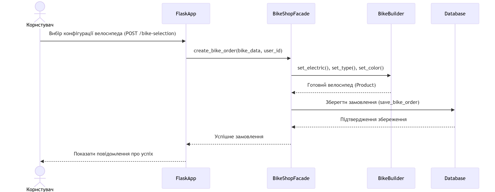

# Опис використаних патернів у проєкті Bike Shop

## 1. Патерн **Singleton (Одинак)**

**Файл:** `models.py` (клас `Database`)

**Призначення:**
- Гарантує, що клас має лише один екземпляр та надає глобальну точку доступу до нього.
- Використовується для керування підключенням до бази даних, щоб уникнути зайвих з'єднань.

**Реалізація:**
```python
class Database:
    _instance = None
    _initialized = False

    def __new__(cls, *args, **kwargs):
        if cls._instance is None:
            cls._instance = super().__new__(cls)
        return cls._instance

    def __init__(self, connection_string=None):
        if not self._initialized:
            connection_string = connection_string or os.getenv('MONGO_URI', 'mongodb://localhost:27017/')
            self.client = MongoClient(connection_string)
            self.db = self.client['bike_shop']
            self.users_collection = self.db['users']
            self.orders_collection = self.db['orders']
            self._initialized = True
```

**Чому саме цей патерн:**
- База даних має бути єдиною для всього додатку, щоб уникнути конфліктів і зайвих витрат ресурсів.
- Забезпечує контрольований доступ до єдиного екземпляра класу.

## 2. Патерн **Builder (Будівельник)**

**Файл:** `builders.py` (клас `BikeBuilder`)

**Призначення:**
- Відділяє конструювання складного об'єкта від його представлення.
- Дозволяє створювати різні конфігурації об'єкта, використовуючи той самий процес конструювання.

**Реалізація:**
```python
class BikeBuilder:
    def __init__(self):
        self.bike = None

    def set_bike_type(self, bike_type):
        if self.bike:
            self.bike.bike_type = bike_type
        return self

    def set_color(self, color):
        if self.bike:
            self.bike.color = color
        return self

    def set_electric(self, is_electric):
        self.bike = ElectricBike() if is_electric else RegularBike()
        return self

    def build(self):
        if not self.bike or not self.bike.bike_type or not self.bike.color:
            raise ValueError("Не вказано обов'язкові поля велосипеда")
        return self.bike
```

**Чому саме цей патерн:**
- Велосипеди можуть мати різні конфігурації (електричні/звичайні, різні кольори та типи).
- Дозволяє гнучко створювати об'єкти з різними параметрами, не ускладнюючи конструктор.
- Забезпечує послідовність процесу створення об'єкта.

## 3. Патерн **Facade (Фасад)**

**Файл:** `facades.py` (клас `BikeShopFacade`)

**Призначення:**
- Надає спрощений інтерфейс до складної підсистеми (в даному випадку - бізнес-логіки магазину).
- Приховує складність системи, надаючи клієнту простий інтерфейс.

**Реалізація:**
```python
class BikeShopFacade:
    @staticmethod
    def validate_user_data(user_data):
        # Валідація даних користувача
        pass

    @staticmethod
    def register_user(user):
        # Реєстрація користувача з відправкою email
        pass

    @staticmethod
    def create_bike_order(bike_data, user_id=None):
        # Створення замовлення велосипеда
        pass

    @staticmethod
    def login_user(login_data):
        # Вхід користувача
        pass

    @staticmethod
    def get_user_orders(user_id):
        # Отримання замовлень користувача
        pass
```

**Чому саме цей патерн:**
- Спрощує взаємодію з складними підсистемами (база даних, відправка email, валідація).
- Надає єдину точку входу для основних операцій додатку.
- Дозволяє легко змінювати внутрішню реалізацію, не змінюючи клієнтський код.

## 4. Патерн **Factory Method (Фабричний метод)**

**Файл:** `models.py` (класи `RegularBike` та `ElectricBike`)

**Призначення:**
- Визначає інтерфейс для створення об'єкта, але залишає підкласам вирішення, який саме клас інстанціювати.
- Використовується для створення різних типів велосипедів.

**Реалізація:**
```python
class Product:
    def __init__(self, bike_type=None, color=None):
        self.bike_type = bike_type
        self.color = color

class RegularBike(Product):
    def __init__(self, bike_type=None, color=None):
        super().__init__(bike_type, color)
        self.is_electric = False

class ElectricBike(Product):
    def __init__(self, bike_type=None, color=None):
        super().__init__(bike_type, color)
        self.is_electric = True
```

**Чому саме цей патерн:**
- Дозволяє створювати різні типи велосипедів (електричні/звичайні) через єдиний інтерфейс.
- Спрощує додавання нових типів велосипедів у майбутньому.


### Опис зв'язків між класами в архітектурі проекту

У проекті використовуються наступні типи зв'язків між класами:

#### 1. **Залежність (Dependency) **
- **FlaskApp --> BikeShopFacade**: 
  Flask додаток залежить від фасаду BikeShopFacade, але не містить його як частину себе. Використовує його методи для обробки бізнес-логіки.

- **BikeBuilder --> Product**:
  Білдер залежить від абстрактного класу Product для створення конкретних велосипедів, але не володіє ними.

#### 2. **Асоціація (Association) **
- **BikeShopFacade -> Database**:
  Фасад використовує Database для зберігання даних. Обидва об'єкти можуть існувати незалежно.

- **BikeShopFacade -> Mail**:
  Фасад використовує Mail для відправки електронних листів.

- **User -> Order**:
  Користувач може мати багато замовлень (один до багатьох).

#### 3. **Агрегація (Aggregation) **
- **BikeShopFacade ◇-- BikeBuilder**:
  Фасад містить BikeBuilder як частину, але BikeBuilder може існувати незалежно (слабке володіння).

#### 4. **Композиція (Composition) **
- **Database ◆-- User**:
  Database повністю володіє колекцією User. Користувачі не можуть існувати без бази даних.

- **Database ◆-- Order**:
  Database повністю володіє колекцією Order. Замовлення не можуть існувати без бази даних.

#### 5. **Успадкування (Inheritance) **
- **Product <|-- RegularBike**:
  RegularBike успадковує властивості та методи від абстрактного класу Product.

- **Product <|-- ElectricBike**:
  ElectricBike успадковує властивості та методи від абстрактного класу Product.

### Додаткові пояснення:
- **FlaskApp** є центральним класом, який координує роботу всієї системи через **BikeShopFacade**
- **BikeShopFacade** виступає єдиною точкою входу для бізнес-логіки, делегуючи задачі:
  - До **BikeBuilder** для створення велосипедів
  - До **Database** для зберігання даних
  - До **Mail** для відправки повідомлень
- **Database** реалізований як Singleton, що гарантує єдиний екземпляр підключення до MongoDB
- **Product** є абстрактним базовим класом для всіх типів велосипедів



### Опис поведінкової UML діаграми (Sequence Diagram)

**Назва:** Процес замовлення велосипеда

#### Учасники процесу:
1. **Користувач** - ініціює процес замовлення через веб-інтерфейс
2. **FlaskApp** - обробляє HTTP-запит
3. **BikeShopFacade** - оркеструє бізнес-логіку
4. **BikeBuilder** - створює об'єкт велосипеда
5. **Database** - зберігає дані замовлення

#### Кроки процесу:

1. **Відправка даних форми**:
   - Користувач заповнює форму вибору велосипеда (тип, колір, наявність електроприводу)
   - Натискає кнопку "Замовити", відправляючи POST-запит на `/bike-selection`

2. **Обробка запиту в FlaskApp**:
   - FlaskApp отримує дані форми
   - Викликає метод `create_bike_order()` фасаду BikeShopFacade, передаючи:
     - Дані про велосипед
     - ID користувача з сесії

3. **Робота BikeShopFacade**:
   - Фасад ініціює створення об'єкта велосипеда через BikeBuilder:
     - Викликає `set_electric()` для визначення типу
     - Викликає `set_bike_type()` для встановлення типу
     - Викликає `set_color()` для вибору кольору
   - Отримує готовий об'єкт Product після виклику `build()`

4. **Збереження даних**:
   - BikeShopFacade зберігає інформацію про замовлення в Database через `save_bike_order()`
   - Database повертає підтвердження успішного збереження

5. **Завершення операції**:
   - BikeShopFacade повертає результат обробки в FlaskApp
   - FlaskApp відображає повідомлення про успішне замовлення
   - Користувач бачить підтвердження з деталями замовлення


## Тестування шаблонів проектування та функціоналу

### 1. Singleton (Одинак) - 2 тести
**Тестування класу Database**
1. **test_database_singleton_same_instance**  
   - Перевіряє, що створюється лише один екземпляр бази даних  
   - Очікуваний результат: db1 і db2 - це один і той же об'єкт  
   - Код перевірки: `self.assertIs(db1, db2)`

2. **test_database_initialized_once**  
   - Перевіряє одноразову ініціалізацію бази даних  
   - Очікуваний результат: однакові налаштування в обох екземплярах  
   - Перевіряє: `db1.db.name == db2.db.name`

### 2. Builder (Будівельник) - 4 тести
**Тестування класу BikeBuilder**
3. **test_bike_builder_valid_regular_bike**  
   - Перевіряє створення звичайного велосипеда  
   - Очікуваний результат: коректний RegularBike з атрибутами  
   - Перевіряє: `isinstance(bike, RegularBike)`

4. **test_bike_builder_valid_electric_bike**  
   - Перевіряє створення електричного велосипеда  
   - Очікуваний результат: коректний ElectricBike з атрибутами  
   - Перевіряє: `bike.is_electric == True`

5. **test_bike_builder_missing_fields**  
   - Перевіряє обробку відсутніх полів  
   - Очікуваний результат: виняток ValueError  
   - Ситуація: не вказано bike_type

6. **test_bike_builder_no_bike_initialized**  
   - Перевіряє випадок без ініціалізації велосипеда  
   - Очікуваний результат: виняток ValueError  
   - Ситуація: виклик build() без set_electric()

### 3. Facade (Фасад) - 9 тестів
**Тестування класу BikeShopFacade**
7. **test_validate_user_data_valid**  
   - Перевіряє валідацію коректних даних  
   - Очікуваний результат: True  
   - Вхідні дані: всі поля валідні

8. **test_validate_user_data_invalid_email**  
   - Перевіряє невірний email  
   - Очікуваний результат: False  
   - Вхідні дані: "invalid-email"

9. **test_validate_user_data_short_name**  
   - Перевіряє занадто коротке ім'я  
   - Очікуваний результат: False  
   - Вхідні дані: ім'я з 1 символу

10. **test_validate_user_data_short_password**  
    - Перевіряє занадто короткий пароль  
    - Очікуваний результат: False  
    - Вхідні дані: пароль з 5 символів

11. **test_register_user_invalid_data**  
    - Перевіряє реєстрацію з невірними даними  
    - Очікуваний результат: ValueError  
    - Вхідні дані: невалідний email, коротке ім'я

12. **test_create_bike_order**  
    - Перевіряє створення замовлення  
    - Очікуваний результат: замовлення в базі даних  
    - Перевіряє: `order['bike_type'] == "Mountain"`

13. **test_login_user_success**  
    - Перевіряє успішний вхід  
    - Очікуваний результат: ID користувача  
    - Передумова: користувач у базі

14. **test_login_user_invalid_credentials**  
    - Перевіряє вхід з помилковими даними  
    - Очікуваний результат: None  
    - Вхідні дані: неправильний пароль

15. **test_get_user_orders**  
    - Перевіряє отримання замовлень  
    - Очікуваний результат: список замовлень  
    - Перевіряє: `len(orders) == 1`

### 4. Factory Method (Фабричний метод) - 2 тести
**Тестування класів велосипедів**
16. **test_regular_bike_is_not_electric**  
    - Перевіряє RegularBike  
    - Очікуваний результат: `is_electric == False`  
    - Перевіряє атрибути: тип, колір

17. **test_electric_bike_is_electric**  
    - Перевіряє ElectricBike  
    - Очікуваний результат: `is_electric == True`  
    - Перевіряє атрибути: тип, колір

### 5. Тести маршрутів Flask - 4 тести
18. **test_register_route_success**  
    - Перевіряє успішну реєстрацію  
    - Очікуваний результат: статус 302 (перенаправлення)  
    - Перевіряє: `response.location.endswith('/bike-selection')`

19. **test_bike_selection_route_unauthenticated**  
    - Перевіряє доступ без авторизації  
    - Очікуваний результат: перенаправлення на реєстрацію  
    - Перевіряє: `response.location.endswith('/register')`

20. **test_login_route_success**  
    - Перевіряє успішний вхід  
    - Очікуваний результат: перенаправлення на головну  
    - Передумова: існуючий користувач

21. **test_save_user_and_save_bike_order**  
    - Інтеграційний тест збереження даних  
    - Перевіряє коректність роботи з MongoDB  
    - Очікуваний результат: дані зберігаються і читаються


### Результати аналізу якості коду з SonarQube

#### Загальний стан проекту:
- **Статус якості коду**: Усі критерії пройдено (Required = 0 нових проблем)
- **Період аналізу**: Нові зміни з 3 червня 2025 року (1 день аналізу)

#### Основні метрики:

1. **Надійність (Reliability)**
   - **Покриття коду (Coverage)**: 81.5% (54 рядки) при мінімальному вимозі 80.0%
   - **Відкриті проблеми**: Відсутні

2. **Безпека (Security)**
   - **Security Hotspots**: 7 потенційних проблем
   - **Прийняті проблеми (Accepted issues)**: Валідні проблеми, які не були виправлені

3. **Підтримуваність (Maintainability)**
   - **Дублювання коду**: 0.0% (616 рядків) при максимально допустимих 3.0% 
   - **Відкриті проблеми**: Відсутні


## **Масштабованість**  

### **1. Модульна архітектура**
Код розділений на логічні модулі, що дозволяє легко додавати нові функції без змін існуючої логіки:
- **`models.py`** – містить класи даних (User, Product, Database).
- **`builders.py`** – реалізує патерн Builder для створення велосипедів.
- **`facades.py`** – інкапсулює бізнес-логіку (реєстрація, замовлення, вхід).
- **`app.py`** – обробляє HTTP-запити та маршрутизацію.

**Переваги:**
- Нова функціональність додається шляхом створення окремих модулів або розширення існуючих.
- Зміни в одному модулі не впливають на інші.

### **2. Гнучкість через патерни проектування**
- **Builder (`BikeBuilder`)**  
  Дозволяє легко додавати нові параметри велосипедів (наприклад, розмір колеса, матеріал рами) без змін існуючого коду.

- **Facade (`BikeShopFacade`)**  
  Приховує складність роботи з базою даних, листами та валідацією. Якщо в майбутньому зміниться спосіб зберігання даних (наприклад, перехід на PostgreSQL), достатньо змінити лише `BikeShopFacade`, а не весь код.

- **Singleton (`Database`)**  
  Гарантує єдине підключення до БД, що запобігає накладним витратам при масштабуванні. Для переходу на кластерну базу даних (наприклад, MongoDB Atlas) достатньо змінити лише клас `Database`.

### **3. Підтримка різних СУБД**
- Зараз використовується **MongoDB**, але архітектура дозволяє підключити будь-яку іншу базу даних (PostgreSQL, MySQL) шляхом реалізації нового адаптера в `Database`.

### **4. Легке додавання нових типів велосипедів**
- Завдяки **Factory Method** (класи `RegularBike` та `ElectricBike`) можна додати новий тип велосипеда (наприклад, `FoldingBike`) без змін існуючої логіки

### **5. Можливість масштабування API**
- Маршрути Flask (`app.py`) легко розширюються для підтримки нових ендпоінтів (наприклад, додавання відгуків, системи знижок).


## ** Принципи Дизайну**  
У проєкті використано **SOLID** та **DRY** для забезпечення чистоти коду та легкості підтримки.

### **1. SOLID**
#### **Принцип єдиного обов’язку (Single Responsibility)**
- Один клас = одна задача:
  - `BikeBuilder` – створює велосипеди.
  - `BikeShopFacade` – інкапсулює бізнес-логіку.
  - `Database` – керує підключенням до БД.

#### **Принцип відкритості/закритості (Open/Closed)**
- Класи `RegularBike` та `ElectricBike` закриті для модифікації, але відкриті для розширення (можна додати нові типи велосипедів).

#### **Принцип підстановки Лісков (Liskov Substitution)**
- Дочірній клас має працювати так само, як батьківський.
- Підкласи (`RegularBike`, `ElectricBike`) можуть замінювати базовий клас `Product` без порушення роботи системи.

#### **Принцип розділення інтерфейсу (Interface Segregation)**
- Класи не залежать від методів, які не використовують (наприклад, `BikeBuilder` не вимагає реалізації методів, пов’язаних із базою даних).

#### **Принцип інверсії залежностей (Dependency Inversion)**
- `BikeShopFacade` залежить від абстракцій (наприклад, `Database`), а не від конкретних реалізацій.

### **2. DRY (Don’t Repeat Yourself)**
- Логіка валідації, роботи з БД та побудови велосипедів винесена в окремі методи:
  - Валідація email/пароля в `BikeShopFacade.validate_user_data()`.
  - Збереження даних через `save_user()` та `save_bike_order()`.


  

